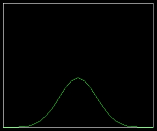

Simple test
------------

Ensure your device works with this simple test.

.. literalinclude:: ../examples/plot_simpletest.py
    :caption: examples/plot_simpletest.py
    :lines: 5-

Cartesian Simple Test
----------------------------

Cartesian Simple Test

.. literalinclude:: ../examples/cartesian_simpletest.py
    :caption: examples/cartesian_simpletest.py
    :lines: 5-

Cartesian Line Types
----------------------------

Cartesian Line Types examples

.. literalinclude:: ../examples/cartesian_linetypes.py
    :caption: examples/cartesian_linetypes.py
    :lines: 5-

Cartesian Fill
----------------------------

Cartesian Curve fill

.. literalinclude:: ../examples/cartesian_fill.py
    :caption: examples/cartesian_fill.py
    :lines: 5-

Cartesian Trig functions
----------------------------

Cartesian Trigonometric functions example

.. literalinclude:: ../examples/cartesian_trig_functions.py
    :caption: examples/cartesian_trig_functions.py
    :lines: 5-
.. image:: ../docs/cartesian_trig.jpg

Scatter Simple Test
---------------------

Scatter simple test

.. literalinclude:: ../examples/scatter_example.py
    :caption: examples/scatter_example.py
    :lines: 5-

Scatter Variable Radius
------------------------

Scatter example using different Radii for each data point

.. literalinclude:: ../examples/scatter_circle_variable_radius.py
    :caption: examples/scatter_example.py
    :lines: 5-

Scatter Different Datasets
----------------------------

Scatter example using different datasets

.. literalinclude:: ../examples/scatter_different_datasets.py
    :caption: examples/scatter_different_datasets.py
    :lines: 5-
.. image:: ../docs/scatter_datasets.jpg

Scatter Different Pointers
----------------------------

Scatter example using different Pointers

.. literalinclude:: ../examples/scatter_pointers.py
    :caption: examples/scatter_pointers.py
    :lines: 5-

Bar Simple Test
----------------------------

Bar Simple Test

.. literalinclude:: ../examples/bar_simpletest.py
    :caption: examples/bar_simpletest.py
    :lines: 5-

Logging Simple Test
----------------------------

Logging Simple Test

.. literalinclude:: ../examples/logging_simpletest.py
    :caption: examples/logging_simpletest.py
    :lines: 5-

Logging Animation
----------------------------

Logging Animation

.. literalinclude:: ../examples/logging_animation.py
    :caption: examples/logging_animation.py
    :lines: 5-

Map Simpletest
----------------------------

Map Simpletest

.. literalinclude:: ../examples/map_simpletest.py
    :caption: examples/map_simpletest.py
    :lines: 5-

